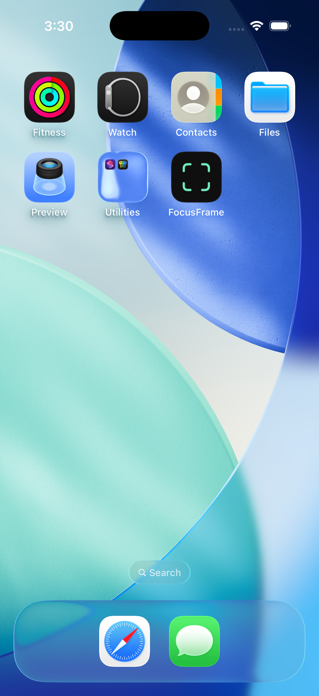
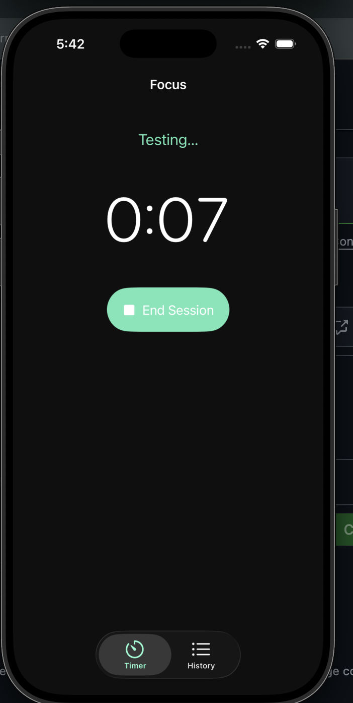
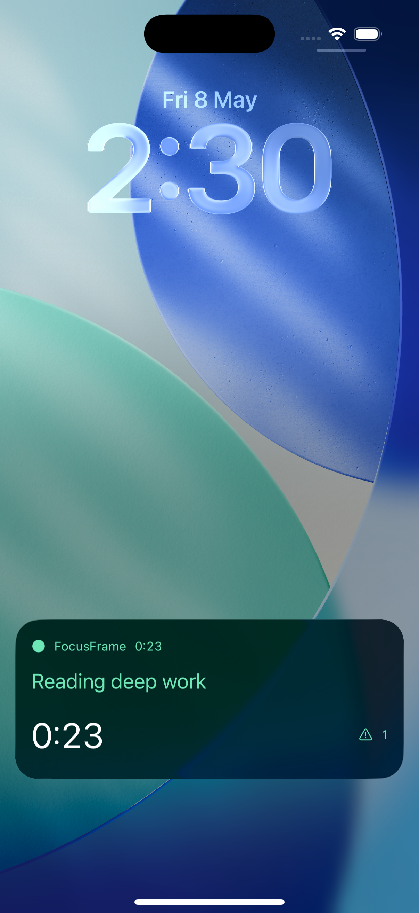
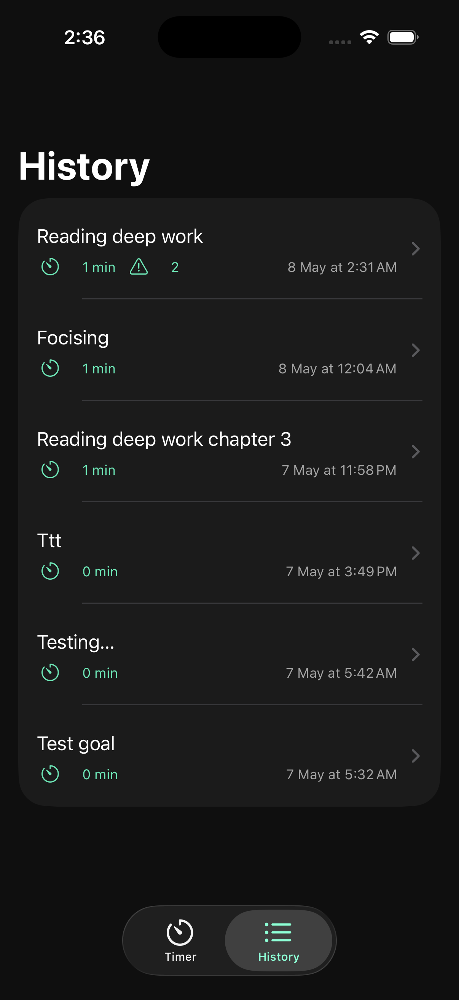
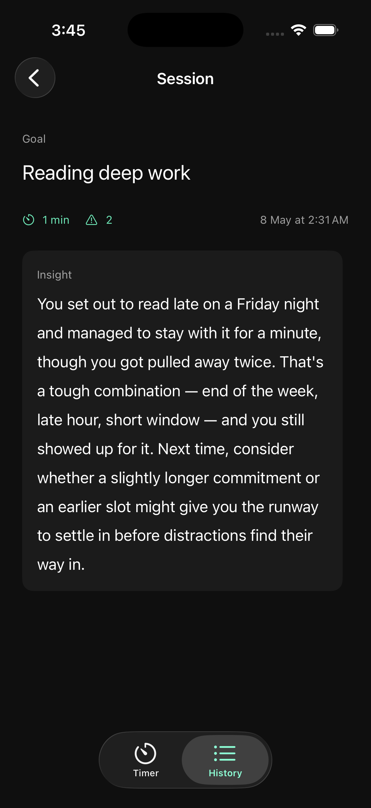

# FocusFrame

Focus sessions, AI-coached. A native iOS app showcasing the full modern Apple platform stack — SwiftUI 6, SwiftData, ActivityKit, and Anthropic Claude API integration.

> **"If your team is still doing work an agent could do, you are not behind on software. You are behind on leverage."**
> — Shery Labs

## What it does

The user types a goal in plain English, runs a focus session, and receives a 2–3 sentence reflective insight from Anthropic's Claude API at the end of every session. A Live Activity occupies the lock screen and Dynamic Island for the duration of the session, ticking in real time via `Text(timerInterval:)`. ScenePhase-based distraction detection counts every time the user backgrounds the app mid-session and feeds that count into both the on-screen timer UI and the AI's session reflection.

## Showcase

|  |  |
| :---: | :---: |
| **Home-screen icon** | **Active focus session** |
| Mint viewfinder on dark, system-wide brand consistency | Large monospace clock, distraction-free composition |

|  |  |
| :---: | :---: |
| **Lock-screen Live Activity** | **Session history** |
| Goal text, ticking timer, distraction badge updating in real time via ActivityKit | Chronological list with distraction count badges and tap-to-view detail |

|  |
| :---: |
| **AI insight** |
| 2–3 sentence Claude reflection generated post-session, persisted via SwiftData |

## Tech stack


## Architecture

Five layers, strict directional dependency (left depends only on right):

```
Views ──► State (@Observable AppState) ──► Services ──► Data Models (@Model)
                                                                ▲
                                  Live Activity (Widget Ext) ───┘
```

**1. Data Models** — SwiftData `@Model` classes (`Session`, `Goal`, `Insight`). UUID foreign keys, no SwiftData relationships in v1. Storage-only types, no business logic, no view-tier dependencies. Schema documented in `agent_docs/data-models.md`.

**2. Services** — Pure-Swift classes performing one domain function each: `SessionManager` (session lifecycle + ActivityKit driver), `DistractionDetector` (ScenePhase observation), `ClaudeService` (Anthropic API I/O with full HTTP error matrix), `KeychainService` (the only file in the codebase that calls `SecItem*` APIs). Zero SwiftUI imports. Fully unit-testable in isolation.

**3. State** — A single `@Observable @MainActor AppState` composes the services in dependency order and exposes view-facing state. Views read from `AppState` via `@Environment`. Views never instantiate services directly; the composition root is the only place service instances are created.

**4. Views** — SwiftUI screens organized by feature: `RootView` (TabView shell), `TimerView`, `HistoryView`, `SessionDetailView`, `SettingsView`. Views may use `@Query` for read-only fetches, but every write flows through `SessionManager`. Zero `modelContext.insert/delete/save` calls anywhere in the view layer.

**5. Live Activity** — Separate Widget Extension target (`FocusFrameLiveActivityExtension`). Renders the lock-screen card and the four Dynamic Island layouts (compact, expanded, minimal). Cannot import the main app target. State arrives via ActivityKit's native `ContentState` IPC.

Layer boundaries are mechanically enforced via `.claude/rules/architecture.md` and a custom architectural-advisor subagent. Services are SwiftUI-free, views never mutate `modelContext`, and `ActivityKit` imports are isolated to `SessionManager` plus the widget target.

## Sprint history

- **Sprint 1 ([PR #1](https://github.com/sheharyarr-ahmed/focusframe/pull/1)) — Foundation**: SwiftData models (`Session`, `Goal`, `Insight`), `SessionManager`, `TimerView`, `HistoryView`.
- **Sprint 2 ([PR #2](https://github.com/sheharyarr-ahmed/focusframe/pull/2)) — Intelligence**: `KeychainService`, `ClaudeService` with full HTTP error matrix and Test-Connection probe, `SettingsView`, `SessionDetailView` with reactive insight rendering.
- **Sprint 3 ([PR #3](https://github.com/sheharyarr-ahmed/focusframe/pull/3)) — Live Activities**: Widget Extension target, `FocusSessionAttributes` + `FocusSessionLiveActivity`, ActivityKit lifecycle in `SessionManager`, `DistractionDetector` wired to ScenePhase, force-kill orphan cleanup.
- **Sprint 4 ([PR #4](https://github.com/sheharyarr-ahmed/focusframe/pull/4)) — Polish**: app icon, README, accessibility audit, demo video, Swift Charts trends in `HistoryView`.

## Built by

**Sheharyar Ahmed** — Shery Labs, AI-Native Software Studio

[GitHub](https://github.com/sheharyarr-ahmed) · [Upwork](https://upwork.com/freelancers/sherylabs) · [LinkedIn](https://linkedin.com/in/sheharyar-ahmed-89598b226) · [X](https://x.com/real_sheharyar) · [sheharyar.softwareengineer@gmail.com](mailto:sheharyar.softwareengineer@gmail.com)

### Known constraints

FocusFrame currently builds against a free-tier Apple Developer account, which constrains the deployment surface:

- **Simulator-only deployment** in the current state — no provisioning for physical devices.
- **App Groups capability deferred** — the bundle id `com.sheryahmed.focusframe` is globally claimed in Apple's developer database; only a paid-tier account resolves the conflict. ActivityKit's native `ContentState` IPC handles all v1 widget state passing, so no functionality is blocked by this deferral.
- **App Store distribution out of scope for v1.**

Paid-tier upgrade is a known Sprint 5+ trigger that unlocks physical-device testing, App Groups, push-driven Live Activity updates, and TestFlight distribution.
